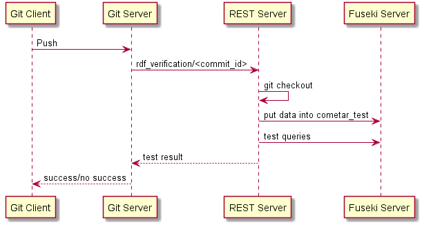

Installation steps in case of docker usage:

- Edit `git_and_nginx/data/browser_conf.json`
- Execute command `docker-compose up --build`
- Create user access file for git with command `htpasswd -c /etc/nginx/auth/.htpasswd_git USERNAME`

Web access:
- CoMetaR browser: `http://localhost:8080/`
- Fuseki: `http://localhost:8080/fuseki`
- REST api: `http://localhost:8080/rest`

The following sequence diagram illustrates the work flow during a git push:

